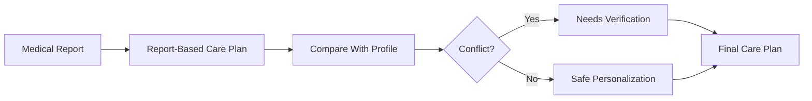
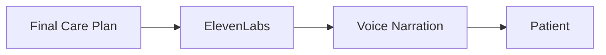
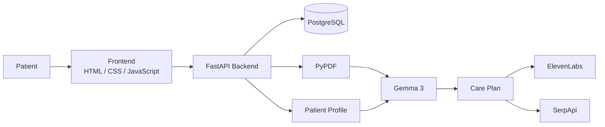
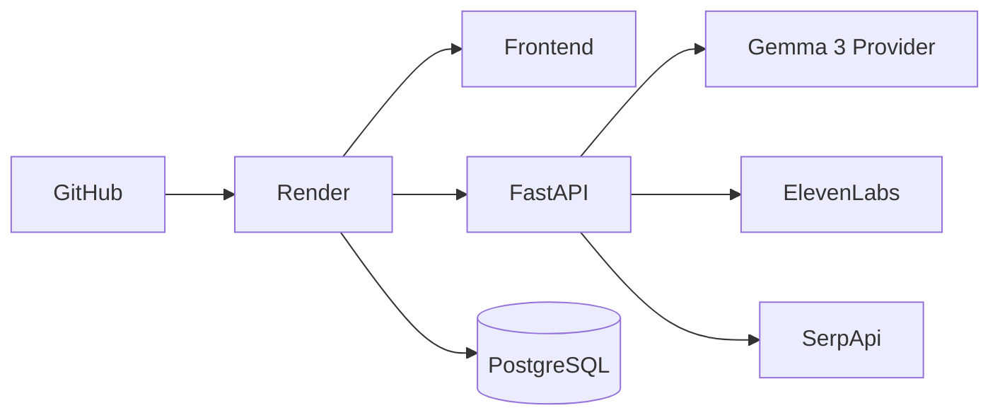

<p align="center">
  
</p>

<h2 align="center">NipCure</h2>

<p align="center">
  An AI-powered healthcare assistant designed to help older adults understand and manage information from their medical reports.
</p>

---

## What is NipCure?

NipCure is a healthcare assistant designed with **older adults** in mind. It transforms complex medical PDF reports into clear, structured **Care Plans** containing medications, instructions, warnings, follow-ups, and questions for the doctor.

Patients can also add their **age, allergies, dietary restrictions, and preferences**. NipCure compares this profile with the report to detect potential conflicts and mark them as **“Needs verification.”**

The goal is simple: make medical information **easier to understand, organize, and remember** (not replace healthcare professionals).

---

## How It Works

The core workflow is intentionally simple:


The medical report is always processed **before** the patient's profile.

This means the patient's preferences do not change or override the information extracted from the medical document.

---

## Care Plan

The generated Care Plan organizes the information into simple sections:

```text
Care Plan
├── Important Warnings
├── Medications
├── What To Do
├── Food Guidance
├── Follow-Up
├── Questions For Your Doctor
└── Evidence & Sources
```

This structure is designed to make the result easier to scan and understand, particularly for older users who may not want to read through a long medical document.

---

## Patient Profile

Each patient can maintain a personal profile containing:

```text
Patient Profile
├── Age
├── Allergies
├── Food Preferences
├── Foods to Avoid
├── Dietary Restrictions
└── Additional Notes
```

The profile is used for **comparison and personalization**, not as a replacement for the medical report.



---

## Accessibility

NipCure was designed with older adults in mind.

The interface focuses on:

- Large and readable text
- Clear sections
- Simple navigation
- High-contrast elements
- Large buttons
- Minimal unnecessary interaction
- Voice access to the Care Plan
- Clear warnings and important information
- Avoiding complex medical terminology where possible

The objective is to make the application usable even for someone who is not comfortable with complex digital interfaces.

---

## Voice Assistance

NipCure integrates **ElevenLabs** to convert the final Care Plan into a natural voice narration.



This provides an alternative to reading the entire Care Plan and can be particularly useful for older adults.

If ElevenLabs is unavailable, NipCure can fall back to the browser/device speech synthesis.

---

## Educational Resources

NipCure also provides a **Learn More** section using **SerpApi**.

The system searches for educational resources related to topics explicitly identified in the medical report.


The research component is intentionally separated from the Care Plan generation.

Search results are **educational only** and are not used to generate, modify, or override medical instructions.

The system prioritizes resources from recognized medical institutions and organizations such as:

- Mayo Clinic
- MedlinePlus / NIH
- CDC
- Cleveland Clinic
- NHS
- Harvard Health Publishing

---

## Technical Architecture

At a high level, NipCure consists of a frontend, FastAPI backend, database, AI layer, and external services.



---

## Project Structure

```text
NipCure/
│
├── backend/
│   ├── app/
│   │   ├── ai/
│   │   │   ├── gemma.py
│   │   │   ├── prompts.py
│   │   │   └── schemas.py
│   │   │
│   │   ├── auth.py
│   │   ├── database.py
│   │   ├── models.py
│   │   ├── schema.py
│   │   └── main.py
│   │
│   ├── requirements.txt
│   └── .env
│
├── frontend/
│   ├── assets/
│   │   └── logo.svg
│   │
│   ├── css/
│   │   └── style.css
│   │
│   ├── js/
│   │   ├── api.js
│   │   ├── config.js
│   │   ├── dashboard.js
│   │   ├── login.js
│   │   ├── profile.js
│   │   └── register.js
│   │
│   ├── dashboard.html
│   ├── index.html
│   ├── login.html
│   ├── profile.html
│   └── register.html
│
├── render.yaml
├── .gitignore
└── README.md
```

---

## Tools & Technologies

| Area | Technology | Purpose |
|---|---|---|
| AI | **Gemma 3** | Understand medical reports and generate Care Plans |
| Local AI Runtime | **Ollama** | Run Gemma 3 locally during development |
| Backend | **Python / FastAPI** | API and application logic |
| ORM | **SQLAlchemy** | Database interaction |
| Frontend | **HTML / CSS / JavaScript** | Patient interface |
| Database | **PostgreSQL** | Users, profiles, and reports |
| PDF | **PyPDF** | Extract text from medical PDFs |
| Voice | **ElevenLabs** | Care Plan voice narration |
| Research | **SerpApi** | Educational medical resource discovery |
| Authentication | **JWT / bcrypt** | Authentication and password security |
| Deployment | **Render** | Frontend, backend, and database hosting |

---

## Main Integrations

### Gemma 3

**Gemma 3** is at the core of NipCure.

It processes the extracted medical report and produces a structured Care Plan based on the information contained in the document.

### Ollama

During development, Gemma 3 runs locally through **Ollama**, allowing the AI pipeline to be developed and tested without depending on a proprietary AI API.

### ElevenLabs

Used for natural voice narration of the final Care Plan.

### SerpApi

Used to discover additional educational resources related to the medical topics found in the report.

### PostgreSQL

Stores:

- User accounts
- Patient profiles
- Uploaded report information
- Generated Care Plans

### Render

Used to deploy the application:



---

## Safety Approach

NipCure follows a **report-first** approach:


The system is designed to avoid:

- Inventing medications or dosages
- Inventing medical instructions
- Silently overriding information from the report
- Using web search results as medical instructions
- Presenting the system as a replacement for a doctor

When information is unclear or conflicting, the system can mark it as **"Needs verification"**.

For development and testing, NipCure should use **synthetic or de-identified medical documents** rather than real patient data.

---

## API

The backend exposes REST endpoints for the main application features:

```text
Authentication
POST   /api/auth/register
POST   /api/auth/login

Profile
GET    /api/profile
PUT    /api/profile

Reports
GET    /api/reports
POST   /api/reports
GET    /api/reports/{id}
DELETE /api/reports/{id}
POST   /api/reports/{id}/reexamine
POST   /api/reports/{id}/voice
GET    /api/reports/{id}/research
```

---

## Deployment

NipCure includes a `render.yaml` configuration for deployment with **Render**.

The deployment can contain:

- Static frontend
- FastAPI backend
- PostgreSQL database
- Environment-based API credentials
- Health checks

External services such as ElevenLabs and SerpApi are configured through backend environment variables.

---

## License

MIT License.

---

## Hacktoberfest

Built for the **Hacktoberfest Weekend Challenge: Build for a Friend**.

## Why "NipCure"?

**NipCure** = **Nippur + Cure**.

Nippur gave us one of the oldest known medical texts. We just gave it a **21st-century AI upgrade**. 🫠